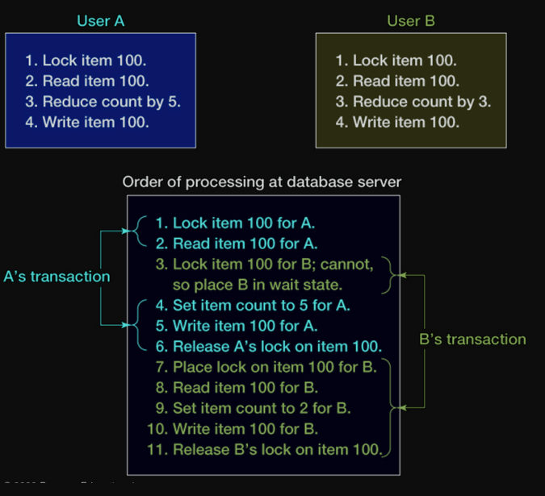
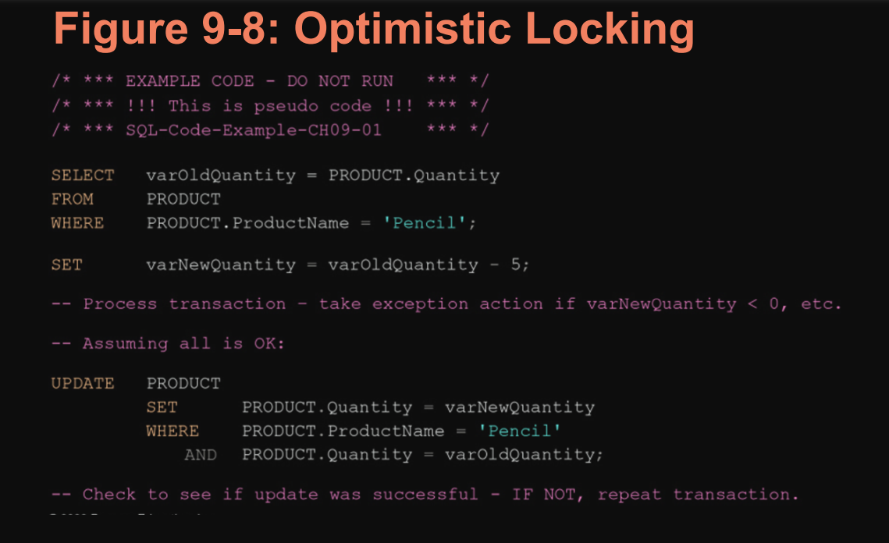
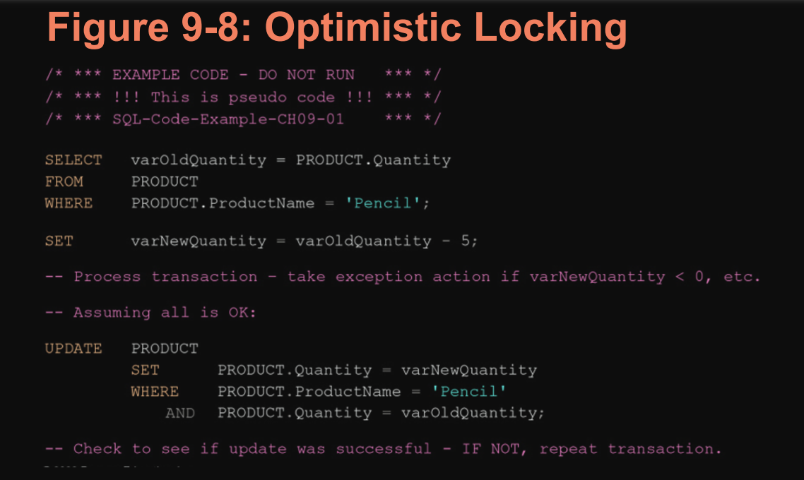
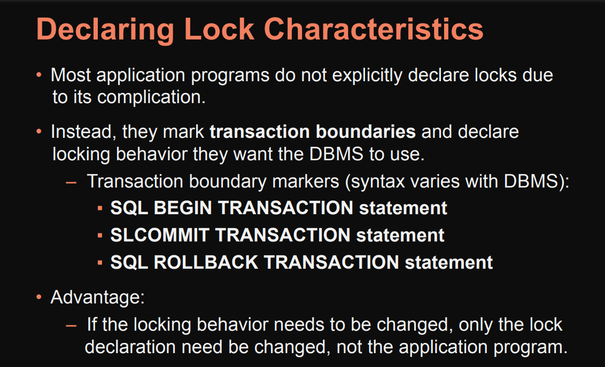
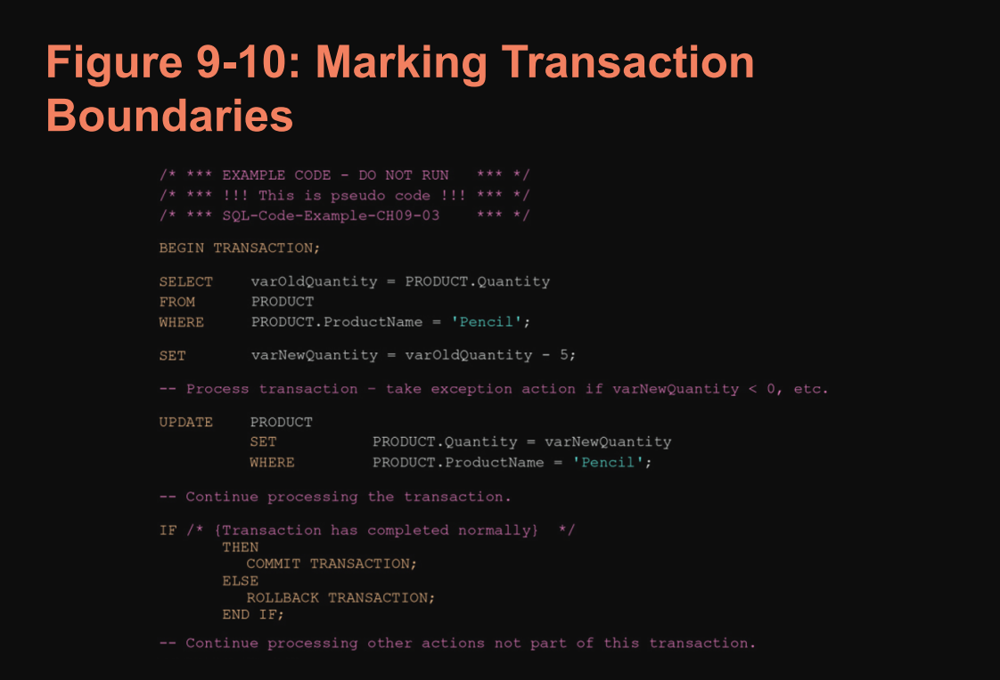
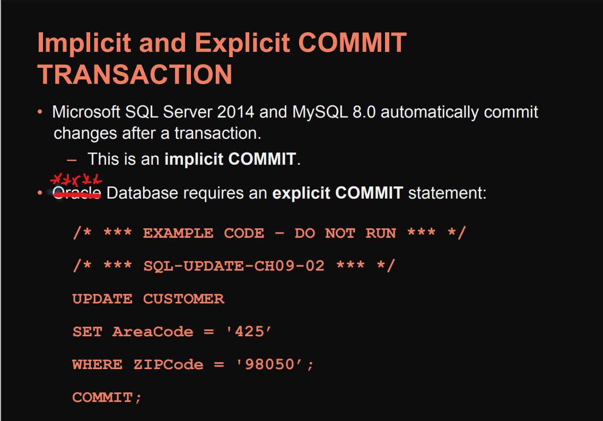

### Double Not exist explanation from Bard.
This SQL query might seem complex at first glance, but it's actually trying to achieve a specific goal: finding all artists who are not of interest to any customer. Let's break it down step by step:

1. Starting with the inner-most subquery:
```sql
SELECT CAI.CustomerID FROM CUSTOMER_ARTIST_INT AS CAI WHERE C.CustomerID = CAI.CustomerID AND A.ArtistID = CAI.ArtistID
```
This part checks if there's an entry in the CUSTOMER_ARTIST_INT table (CAI) where the CustomerID matches the current C.CustomerID (from the outer query) and the ArtistID matches the current A.ArtistID (also from the outer query).

If such an entry exists, it means the customer with C.CustomerID is interested in the artist A.ArtistID.

2. The middle `NOT EXISTS`:
```sql
NOT EXISTS (SELECT CAI.CustomerID FROM CUSTOMER_ARTIST_INT AS CAI WHERE C.CustomerID = CAI.CustomerID AND A.ArtistID = CAI.ArtistID))
```
This part negates the inner query. Essentially, it checks if there's NO entry in CUSTOMER_ARTIST_INT for the current C.CustomerID and A.ArtistID.
In other words, if this condition is true, it means none of the customers are interested in the current artist A.ArtistID.

3. The outer `NOT EXISTS` and final selection:
```sql
SELECT A.FirstName, A.LastName FROM ARTIST AS A WHERE NOT EXISTS SELECT C.CustomerID FROM CUSTOMER AS C WHERE NOT EXISTS (SELECT CAI.CustomerID FROM CUSTOMER_ARTIST_INT AS CAI WHERE C.CustomerID = CAI.CustomerID AND A.ArtistID = CAI.ArtistID))
```
This part takes all artists (A) and checks if there's any C.CustomerID (customer) for whom the inner NOT EXISTS condition (no customer is interested) is NOT true.
Remember, the inner NOT EXISTS is checking if no customer is interested. So, the outer NOT EXISTS is essentially checking if at least one customer is interested.
If the outer `NOT EXISTS` is true, it means no customer is interested in the current artist (A.ArtistID), and their FirstName and LastName are added to the result set.
In simpler terms, this query finds all artists who are not listed as being of interest to any customer in the `CUSTOMER_ARTIST_INT` table.

### CH.9 Special thanks to Bard for the Summary

- **Database administration**: Database administration is the process of managing and maintaining a database. This includes tasks such as creating and managing users, setting up security permissions, backing up the database, and recovering from crashes.

- **Concurrency control**: Concurrency control is a mechanism that ensures that multiple users can access and modify a database concurrently without corrupting the data.

    - No single concurrency control technique is ideal for all
circumstances.

    - Trade-offs need to be made between level of protection
and throughput.

-  **Concurrent transactions** refer to two or more
transactions that appear to users as they are being
processed against a database at the same time.

#### Some Other Boring Definitions:
1. **Resource locking** prevents multiple applications from
    obtaining copies of the same record when the record is
    about to be changed.
2. **Locking Terminology**
    * Implicit locks are locks placed by the DBMS.
    * Explicit locks are issued by the application program.
    * Lock granularity refers to size of a locked resource:
    - Rows, page, table, and database level
    * Large granularity is easy to manage but frequently causes
    conflicts.
    * **Lock Types**:
      - An `exclusive lock` prohibits other users from reading the locked
        resource.
      - A `shared lock` allows other users to read the locked resource, but they
        cannot update it.
        

3. #### **Serializable Transactions**
   1.  `Serializable transactions` refer to two transactions that
        run concurrently and generate results that are consistent
        with the results that would have occurred if they had run
        separately.

    2. `Two-phase locking` refers to one of the techniques used
        to achieve serializability
4. #### **Two-Phased Locking**
    - Transactions are allowed to obtain locks as
        necessary (growing phase).
    - Once the first lock is released (shrinking phase), no
        other lock can be obtained.
    - A special case of two-phased locking.
    - Locks are obtained throughout the transaction.
    - No lock is released until the COMMIT or ROLLBACK
        command is issued.
    - This strategy is more restrictive but easier to
        implement than two-phase locking.
5. #### Deadlock, 
    - or the deadly embrace, occurs when two  
        transactions are each waiting on a resource that the other
        transaction holds.
    - Preventing deadlock:
    - Allow users to issue all lock requests at one time.
    - Require all application programs to lock resources in the
        same order.
    - Breaking deadlock:
    - Almost every DBMS has algorithms for detecting
        deadlock. When deadlock occurs, DBMS aborts one of the
        transactions and rolls back partially completed work.        
#### Optimistic vs Pessimistic Locking
* `Optimistic locking` assumes that no transaction conflict will occur.

* DBMS processes a transaction; checks whether conflict
    occurred:
    - If not, the transaction is finished.
    - If so, the transaction is repeated until there is no
        conflict.
* `Pessimistic locking` assumes that conflict will occur. 
    - Locks are issued while the transaction is processed, and
        then the locks are released.
    - Optimistic locking is preferred for the Internet and for many
        intranet applications.









> **Below isn't coming Tomorrow**

- **Security**: Database security is important for protecting sensitive data from unauthorized access. This includes tasks such as using strong passwords, encrypting data, and auditing access to the database.

- **Backup and recovery**: Backing up a database is important for protecting against data loss.  Recovery is the process of restoring a database to a previous state after a crash or other  failure.

- **Transactions**: A transaction is a group of related database operations that are treated as a single unit. Transactions are ACID, which means that they are Atomic, Consistent, Isolated, and Durable.


- **Cursors**: A cursor is a pointer to a specific row in a database table. Cursors are used to fetch rows from a table one at a time.

- **Physical database design**: Physical database design is the process of designing the physical layout of a database on storage media. This includes tasks such as choosing the right storage media, partitioning tables, and creating indexes.

- **Query optimization**: Query optimization is the process of improving the performance of database queries. This includes tasks such as choosing the right indexes, using efficient query plans, and tuning the database server.
